# 2-Way Marketplace Application

**Ross Baker**

Website: https://codeflow-marketplace.herokuapp.com/ 

GitHub Repository: https://github.com/r0ss26/code-flow

## The Problem & Why It Needs Solving.

In an increasingly technological world in which our interactions with computers and machines become more and more prevalent, programming is an increasingly sought after skill. Whether in a technical role, a non-technical role or as a hobby, the number of people seeking out coding lessons continues to increase, as shown by the increasing popularity of coding boot-camps. When it comes to learning how to program there are a number of traditional and non-traditional options for consumers to choose from, each with their own benefits and drawbacks. University courses cover computer science topics in depth and at a low level, however their long duration and expensive course fees can turn people away. There are many programming textbooks which an aspiring programmer can use, however these can be dry and don't offer an interactive element which is key to keeping people engaged. There are plenty of online resources people may turn to such as forums and tutorials. These are a great way to get started with coding due to their low entry barrier, however are limited in a number of ways including:

- Non existent or low quality personal feedback. Online courses through websites such as Udemy and Lynda are produced for a mass audience, thus making it difficult to receive individual and personalised feedback. 
- Varying quality of responses - When posting a question online the response you receive can vary from excellent to underwhelming, and you have no choice over who responds to your question.

Due to these downfalls in the programming education sector, CodeFlow aims to disrupt this market by providing a solution which mixes the best of all of these modes of education, with a focus on personalised and engaging feedback.

CodeFlow has a low barrier to entry, with users able to browse all listings and pick a tutor who they feel best matches their desired learning outcomes. Through the use of profile pages and community reviews, users can be sure that they are choosing a qualified tutor who will provide them with specific and personalised feedback to help them on their coding journey. Learners can build a recurring feedback cycle with the same tutor and get in depth help through a range of options including, code reviews, video, text or phone tutoring, thus merging the benefits of face to face teaching, with those of online learning platforms.

With CodeFlow any user can both teach and learn, helping to create a community of like minded developers. This allows users to share their knowledge in one aspect of programming while also increasing their knowledge in others.

## Description

### Purpose

The purpose of my two-way marketplace application is to bring together a community of programmers and learners who are willing to share and receive knowledge in order to allow the developer community to flourish. CodeFlow aims to bridge the gap between the personalised nature of face-to-face teaching with the convenience and accessibility of online learning platforms. 

### Functionality & Features

#### User authentication

- Users are able to browse all the available listings as well as other users profiles without signing up, this way they can see what's available on the site before you decide to sign up.
- Once a users has signed up, they are able to post listings, purchase listings, message other users and create and edit their own profile.
- Front end and back end validation is used to ensure that users can only perform update, edit and delete operations on items which they have ownership over.

#### Listings

- Listings are the core component of the website which allows users to post their services for other users to browse.

- Users can post multiple listings in different categories.
- Users can upload images to make their listings stand out and also tag them with relevant keywords which will be displayed on the listing.
- Users are able to purchase listings from others users on the site.
- Users can activate and deactivate their listings so that they have control over whether or not other users can see them. This is useful if a seller wants to pause their services and reactivate them later on.

#### User Profiles

- As a user you can create a profile for your account, this is where you can post your relevant employment and education history, this will be available to all other visitors to the site through your listings.
- You can post any text in your biography section to give users more of an insight into your experiences, areas of expertise, services you offer and teaching style.
- You can also post here about what you would like to learn and to introduce yourself to other users.
- Any review that you receive as a seller will show up here. Your average rating will be displayed as well. This is where buyers can see what other users thought of the services you offered, which will allow people to pick the best seller for their needs.

#### Messaging / Chat

- Users are able to message other users on the site. This can be used for text and file based tutoring such as code reviews or text tutoring, and can also be used to organise video and phone call tutoring between seller and buyer.
- Messaging can be done directly from a listing, in case you have a question before purchasing.
- Once you have purchased a listing you can also message the poster from your buyers dashboard.

#### Dashboard

- The dashboard aggregates all of the information a user needs to manage their listings and purchases.
- From the dashboard a user can: 
  - View their purchases.
  - View their favourite listings.
  - View their posted listings.
  - View their sales.
  - View any reviews they have received.
  - Leave reviews for listings they have purchased.
  - Modify their account settings and profile.

	#### Favourites

- Users are able to favourite other users listings which will then be available from their dashboard for easy navigation and to keep track of purchases they are considering.

#### Reviews

- Once a seller has marked an order as completed, a link to review their service will be available to the buyer in their dashboard.
- All reviews are public and are displayed on the sellers profile page.
- A users average rating out of 5 will also be displayed on their profile.

## Site Map

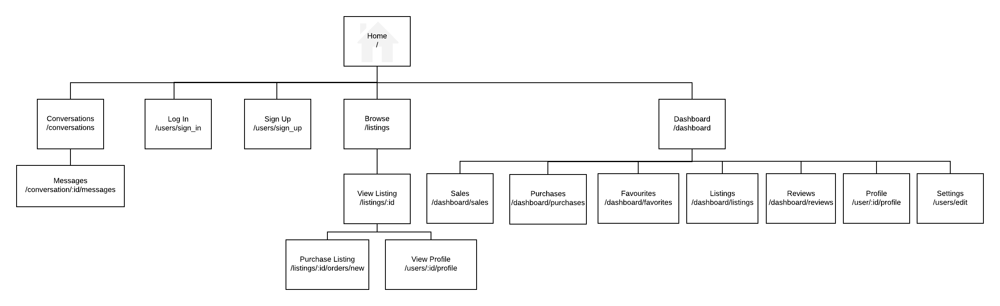

## Screenshots

### Home

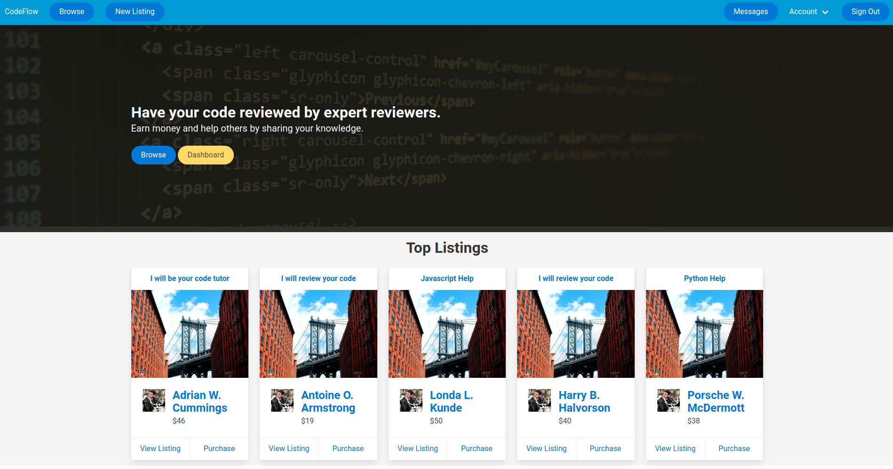

### Browse

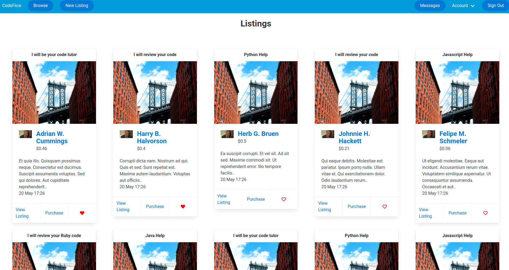

### Profile

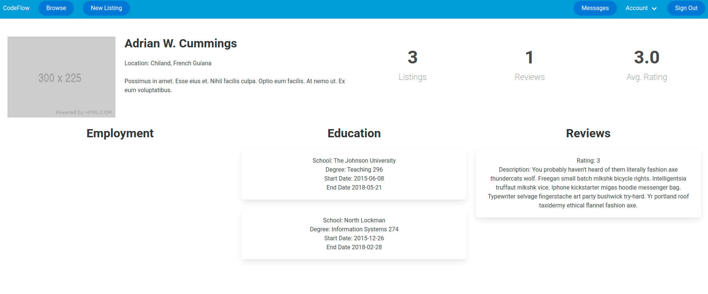

### Form

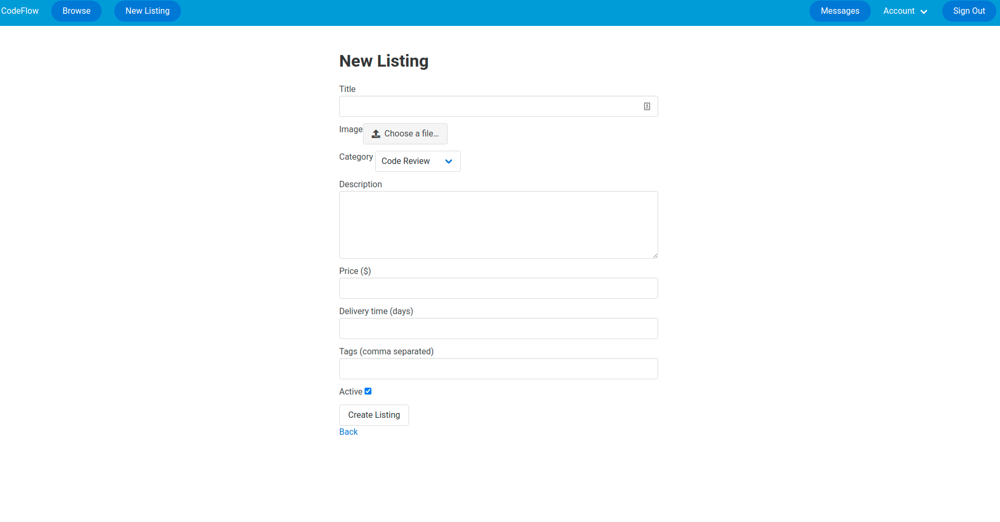

### Dashboard

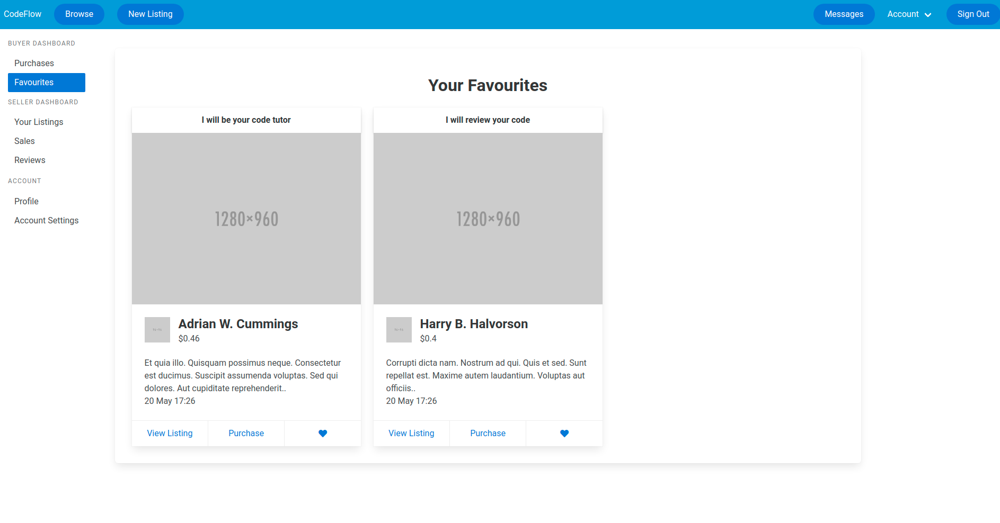

### Chat

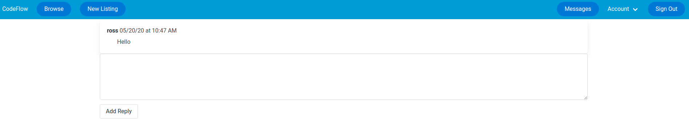

## Target Audience

Broadly speaking the target audience for this application is anyone who wants to learn how to code, or who wants to utilise their existing skills teaching others to code and earn an extra income. More specifically the application aims to appeal to those who need personalised feedback on their code but who don't want to commit to or are unable to access face-to-face study. 

### Tech Stack

#### Front-end

- HTML5
- CSS3
- Embedded Ruby
- Bulma CSS Framework

#### Back-end

- Ruby 2.6.3
- Ruby on Rails 5.2.4

#### Database

- PostgreSQL

**Deployment**

- Heroku Cloud Platform
- Heroku Command Line Interface

#### Project Management

- Trello
- Jira

**Version Control**

- Git
- GitHub

## User Stories

#### Authentication  & Account Management

- As a user I want to be able to create an account.

- As a user I want to be able to edit my credentials.

- As a user I want to be able to log in to my account.

- As a user I want to be able to log out of my account.

- As a user I want to be able to delete my account.

#### Listings

- As a buyer I want to be able to browse listings, so that I can purchase a listing.

- As a buyer I want to be able to favourite a listing, so that I can save it for later.

- As a buyer I want to be able to make a payment for the services offered, so that I can have access to a tutor.

- As a buyer I want to be able to view the top listings, so that I can see at a glance a curated list of listings.

- As a seller I want to be able to post a listing, so that I can offer my services.

- As a seller I want to be able to edit my listing so that I can update it if anything changes.

- As a seller I want to be able to add a category to my listing, so that I can connect with relevant buyers.

- As a seller I want to be able to receive payment for my services.

- As a seller I want to be able to set my own price for my services.

- As a seller I want to be able to tag my listing with relevant keywords.
- As a seller I want to be able to mark an order as complete once the transaction has finished.

#### Profiles

- As a user I want to be able to add my employment history to my profile, so that others can see my experience.

- As a user I want to be able to edit my employment history, so that I can correct any mistakes.

- As a user i want to be able to add my education history to my profile, so that others can see my qualifications.

- As a user I want to be able to edit my education history, so that I can correct any mistakes.

- As a user I want to be able to tell other about myself so that others can connect with me.

- As a user I want to be able to view all the information on another persons profile so that I can get to know them before I purchase from them.

#### Messaging

- As a user I want to be able to message other people on the site, so that we can communicate.
- As a buyer I want to be able to message sellers before I make a purchase so that I can clarify any questions I have.
- As a seller I want to be able to message buyers so that I can answer their questions.

#### Administration

- As a seller I want to be able to view all of my listings so that I can manage my listings from a central place.

- As a buyer I want to be able to view all of my orders so that I can see my order history.

#### Reviews

- As a buyer I want to be able to leave a review for services received so that I can help others using the site.
- As a buyer I want to be able to view a sellers reviews before I make a purchase, so that I can be confident in my purchase.
- As a buyer I want to be able to see a sellers average rating of all their reviews so that I can quickly gauge a sellers quality.
- As a seller I want to be able to receive reviews for my services so that I am rewarded for my efforts.

## Wireframes

### Home Page


### Individual Listing


#### Browse Listings


#### Sign Up


#### Profile Page


#### Listing Administration


## Entity Relationship Diagram

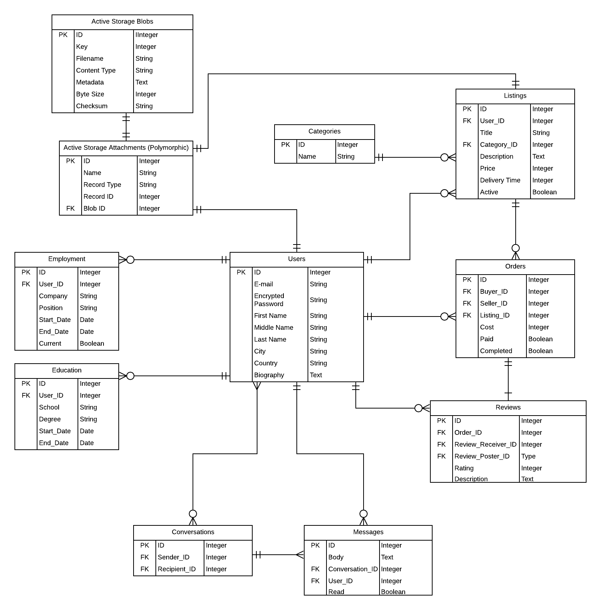

## Explain the different high-level components (abstractions) in your app

### Ruby on rails

My application uses the Ruby on Rails web application framework. This framework utilises the Ruby programming language to handle the processing and retrieval of data between the database, server and user.  This application utilises the ruby on rails philosophy which encapsulates the principles of Don't Repeat Yourself (DRY) in order to allow each component to have single unambiguous function as well as convention over configuration. This allows the application to be efficiently developed and allows for a more maintainable application. 

### The Database

CodeFlow uses the postgreSQL database management system (DBMS) to allow for persistent storage of user information, and tracks all transactions and information within the application. The ruby on rails Object Relational Mapper ActiveStorage is used to abstract away the specific database management system used. This allows us to interact with the database using Ruby code, which has the benefit of making switching DBMS painless– the specific system used is not important and can be changed if necessary. ActiveStorage also allows for data to be validated before storing which improves the security of the application. 

### Heroku

Heroku is a cloud computing Platform as a Service (PaaS) which is used to deploy the application. Heroku also offers postgreSQL as a service which integrates seamlessly with Ruby on Rails. Heroku manages the physical hardware and removes the need for maintaining web servers. Heroku can be interacted with via the command line and also allows us to administer the application from the dashboard on their website.

### Models

There are a number of models utilised by the application in order to encapsulate related data within the application. These models are related to each other which is outlined in the ER Diagram and handle the object oriented approach to managing data within the application. The models also handle data validation for security. 

### Views

Views are used in order to separate the front end templates from the back-end data retrieval and processing logic. The application uses a global template for displaying common layouts, within which is nested a dashboard template used for displaying the dashboard menu. The application uses a number of partial layouts which follow the DRY principle and allow for re-usability of various front end pieces of code– such as the cards for displaying a listing and the tables used for displaying order histories.

### Controllers

The controllers work as a go-between for the data stored in the database and that which is presented to and received from the user. Each model in the application has an associated controller which handles the creation, retrieval, updating and deletion of the items in the database. These controllers follow RESTful API practices. 

My app uses amazon S3 cloud storage in order to store images uploaded by the user to their profiles and to their listings. For demonstration purposes I have included a number of placeholder images which are referenced randomly when the page loads. These are to demonstrate the visuals of the site, however they are not persisted between reloads. When a user uploads an image, this will be persisted in amazon S3 and will be related to the object it was uploaded on.

My app uses the stripe API in order to handle payment processing, this provided users of my site with a trusted payment gateway. Each time a payment is received on a listing, the database is updated to record that item as paid.

## Third Party Services

### Devise

Devise is a Ruby library which integrates with Ruby on Rails and handles all aspects of User authentication. Devise consists of 10 modules, of which CodeFlow uses 5. These are `database_authenticatable` which is responsible for hashing, storing and validating users passwords. `Registerable` which is handles user registration. `Recoverable` which handles user password reset, `validatable` which allows users emails and password to be validated. Lastly `rememberable` manages cookies for remembering users between sessions. Devise handles all aspects of the Model View Controller architecture for authentication. In my app I have customised Devise to add more database fields relating to a user including name and biography information. I have also customised the views by using Bulma as the default form builder in order to integrate Devise's forms more seamlessly into my application.

### Acts as Favoritor

The `acts_as_ favoritor` gem abstracts away the database layer and allows developers to quickly setup a favourites relationship between models. In this application I used acts as favourite in order to define a favourites relationship between a user and any number of listings. The application makes use of a post route in the controller in order to 'toggle' a users like on a listing with a single button click.

### Acts as taggable

The `acts as taggable` gem abstracts the database layer for adding tags to a model. In this application I have used `acts_as_taggable` to allow users to add keyword tags to their listings. When a user creates a listing they can enter a list of tags which gets parsed by `acts_as_taggable` to create a series of tags which are then associated with the listing.

### Font Awesome

Font awesome is an open source icon library which I have used to implement all the icons in my application. To interface with the fontawesome library I have used the font awesome 5 rails gem which provides the rails asset pipeline with font awesome stylesheets. 

### Will Paginate

The `will_paginate` gem is a Ruby library which is used to implement pagination. I have used will paginate in order to paginate the listings index to avoid long scrolling and a better user experience. I have also applied `will_paginate` to the list of users available for messaging.

### Bulma CSS Framework

Bulma is an open source CSS framework which I have used to style my website. Bulma is based on flexbox and uses a column structure in orders to lay out pages. In my page I have used the column pattern in which a columns container is used to specify a number of columns of specific widths in each container. Bulma is mobile first to ensure responsive design. In addition to layout elements Bulma also provides a number of components including navbar's, hero images, buttons and cards which I have used throughout my site.

### Faker

I have used the Faker gem in order to seed the database with representative data in order to demonstrate how the site would look when populated with real data as well as to allow testing and debugging of the site.

### Stripe

I have used the stripe API in order to process payments from users. Stripe is a trusted payment gateway which abstracts the processing of payments. Stripe is useful as it removes the responsibility of handling credit card data and other sensitive information relating to payments.

## Describe your projects models in term of the relationships (active record associations) they have with each other

A User `has_many` employments and an employment `belongs_to` a user.

A user `has_many` educations and an education `belongs_to` a user.

A user has `many_listings` and a listing `belongs_to` a user

A user `has_many` sales (orders) and an order `belongs_to` a seller (user).

A user `has_many` purchases (orders) and an order` belongs_to` a buyer (user).

A user `has_many` received reviews (reviews) and a review `has_one` review receiver (User).

A user `has_many` posted reviews (reviews) and a review `has_one` review poster.

A user `has_one` attached image.

A review `belongs_to` an order and an order `has_one` review.

A message `belongs_to` a conversation and a conversation `has_many` messages.

A message `belongs_to` a user and a user `has_many` messages.

A listing `belongs_to` a category and a category `has_many` listings.

A listing `has_many` orders and an order `belongs_to` a listing.

A listing `has_one_attached` image.

A conversation `belongs_to` a sender (user) and a recipient (use). A user `has_many` conversations defined by the `between` scope on the conversation model.

## Discuss the database relations to be implemented in your application

The User model contains all of the base information for each user. The user also has relationships to other models which add separate information about users - these are the employment model and education model. This is a has many relationship. A user has many educations and a user has many employments. In this way a user can add a complete history of their education and employment by adding an arbitrary number of these models. Each specific employment and education model is associated with one and only one user. The education and employment models are implemented with a belongs_to user association to form an owner belongs to relationship. In this way it is possible to access a users employments and education directly from a user object. Both employments and educations will be deleted if the user account is deleted by defining a dependent destroy relationship, because once the user is deleted their education and employment history has no relevance to the application.

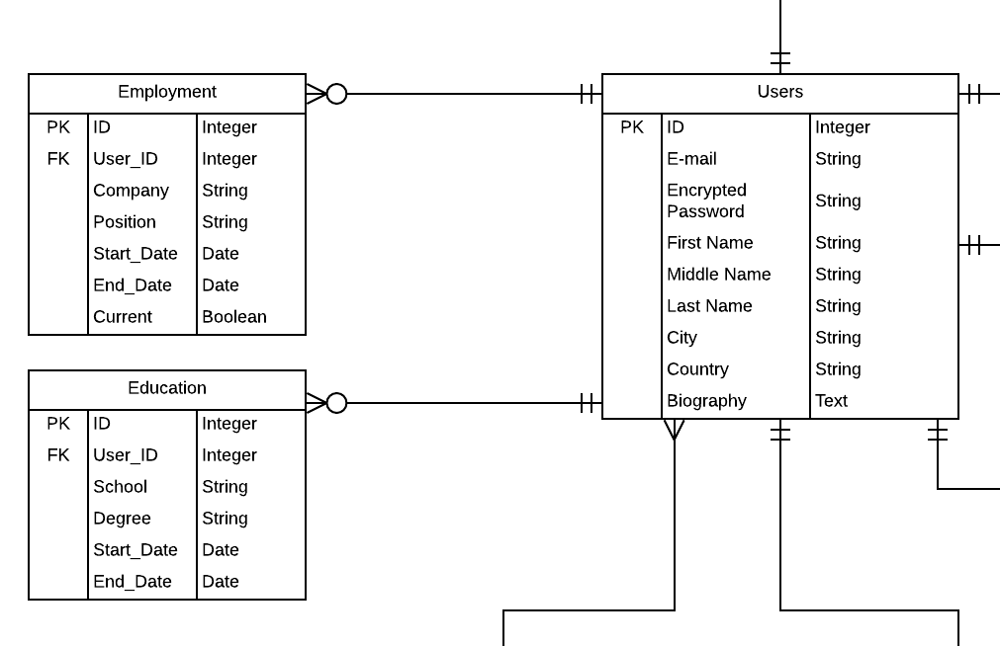

Users are also able to create listings that will be associated with them. This is implemented by the user `has_many` listings relationship, in this way a user can create as many listings as they like. On the other side of this relationship a listing can have only one user it is associated with, this is implemented with a `belong_to` user relationship. The listing itself also has relationships with other models in the app. Firstly is the category model. Each listing can be associated with a category that it falls under. Because the listings falls under the category the listing `belongs_to` a category instance. Each category in the application is predefined but it can have as many listings as necessary under each category, as such each category `has_many` listings. If a category gets deleted by an admin for any reason, any listings associated with that category will also be deleted, as defined by the dependent destroy statement on the `has_many` relationship.

Users of the site can also purchase listings. This is accomplished through an orders model. Individual orders are associated with the listing that was purchased through the `has_many` orders on the listing object. There is a `dependent: :nullify` relationship on this because even if a listing gets deleted, we still want to track the orders so that the buyer can view their purchase history, although they will no longer be able to see the listing, they will still be able to see the other information associated with the order. 


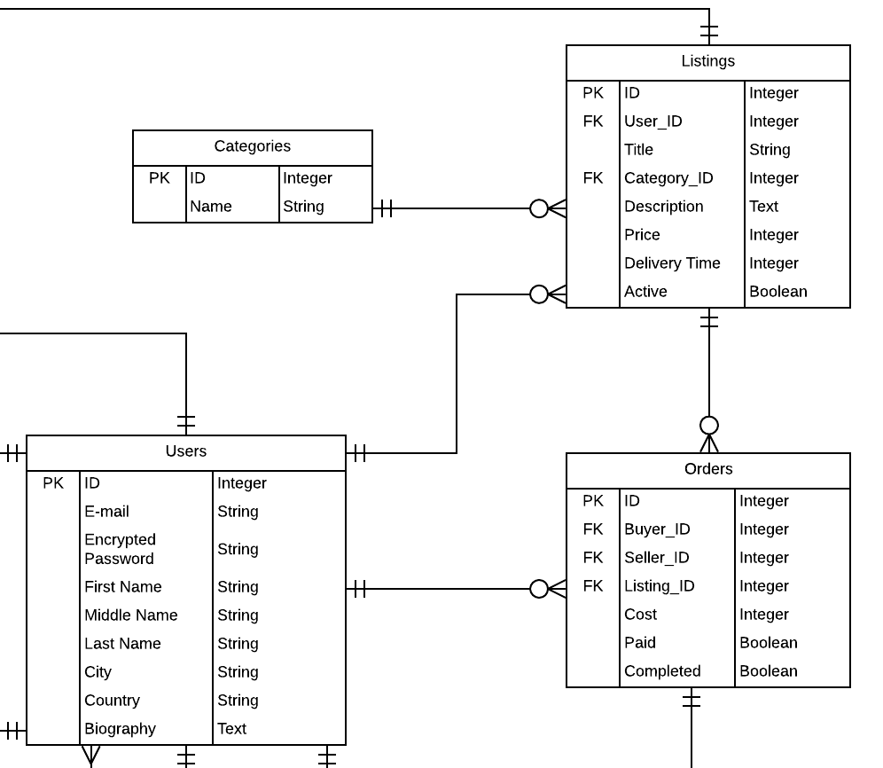

Each order also needs to be associated with two distinct users that the order belongs to, the buyer of the listing and the seller of the listings. This is accomplished by specifying that an order `belongs_to` a buyer and seller which are both users:

```ruby
belongs_to :buyer, class_name: "User"
belongs_to :seller, class_name: "User"
```

In order to efficiently track the most popular listings I have included a counter cache on the belongs to listing association to count the number of times a listing has been purchased with out the need for a separate database query.

An order also has one review associated with it. I have implemented reviews as being unique to an order - that way a user can only leave a review once for each order, but they can leave multiple reviews for the same user if they purchase the same listings more than once. I have implemented this with a `has_one` review relationship on the order model. Each review is associate with the user who left the review as well as the user who the review is for. This is accomplished by having two `belongs_to` associations on the review. A review belongs to the review poster and the review receiver. I have also added a helper method which checks if the user is reviewing itself to avoid cheating of the system.

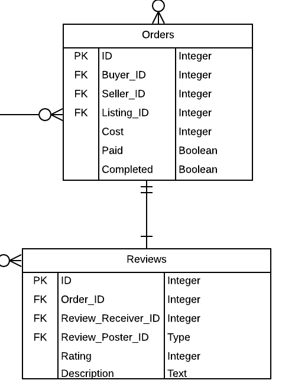

In order to have chat functionality between buyers and sellers I have implemented a conversation model and a message model. Each conversation belongs to the sender and the receiver, the sender is defined as the user that initiates the conversation while the receiver is the user who receives the first message in the conversation. Because a conversation can have any number of messages I have defined a `has_many` messages relationship on the conversations model.

On the other side of this the message model `belongs_to` a conversation. Additional the message belong to the user who sent the message.

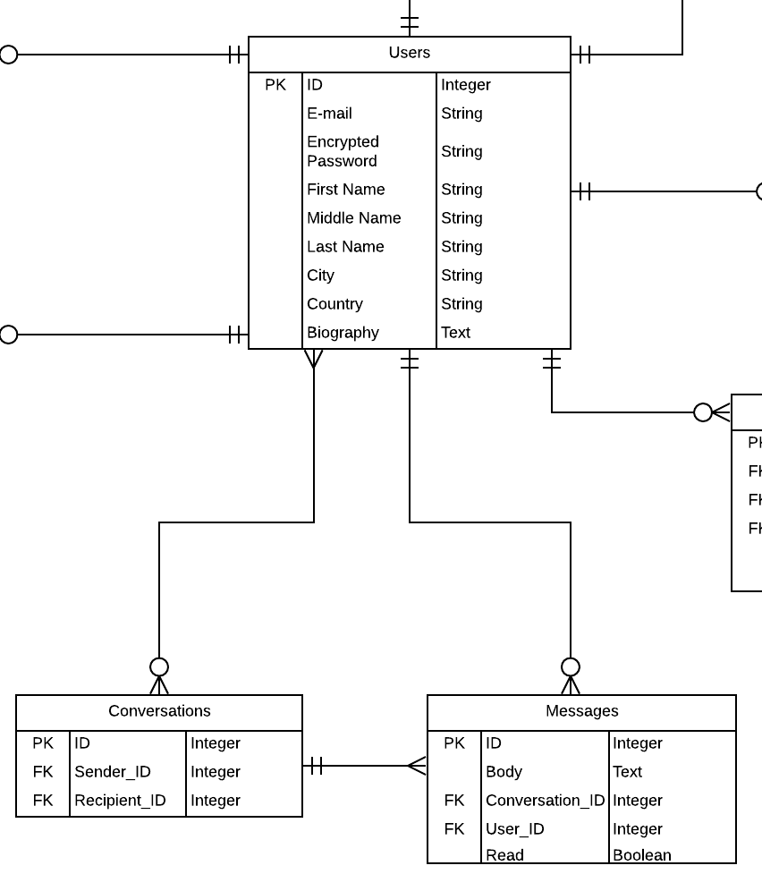

The implementation of the favourites model was abstracted through the use of the `acts_as_favoritor` gem. However this gem defines the relationship that a favourite belongs to the object being favourite and the user who favourite that object.

## Provide your database schema design


### Categories

```ruby
name: string
```

### Conversations

```ruby
sender_id: references
recipient_id: references
```

### Educations

```ruby
user_id: references
school: string
degree: string
start_date: date
end_date: date
```

### Employments

```ruby
user_id: references
company: string
position: string
start_date: date
end_date: date
```

### Listings

```ruby
user_id: references
title: string
category_id: references
description: text
price: integer
delivery_time: integer
active: boolean
```

### Messages

```ruby
body: text
conversation_id: references
user_id: references
read: boolean
```

### Orders

```ruby
listing_id: references
cost: integer
paid: boolean
completed: boolean
buyer_id: references
seller_id: references
```

### Reviews

```ruby
order_id: references
rating: integer
description: text
review_poster_id: references
review_receiver_id: references
```

### Users

```ruby
email: string
password: string
first_name: string
middle_name: string
last_name: string
city: string
country: string
biography: string
```

## Describe the way tasks are allocated and tracked in your project

To begin the planning phase of this app I signed up for a Jira account. I used Jira to create the initial user stories. Within Jira I was able to label user stories relating to their category. I split up the user stories into front-end and back-end tickets, which I was then able to track by adding differing priority levels and due dates. I separated the stories into core functionality and nice to have categories to help manage my priorities. 

 In addition to Jira I also used trello to track my tasks. I separated my trello board into "To Do", "Doing", "Done" and "Paused categories". I used my initial user stories to create a number of cards forming the basis of my app. I added labels to each card to make it easier to quickly get an overview of my progress - the labels I used were front-end, back-end, code and planning. 

I used deadline and the trello calendar to track my progress on the most important items. This way I was able to ensure the MVP items were prioritised and I could plan out days in advance and plan for key milestones in order to reach the deadline.

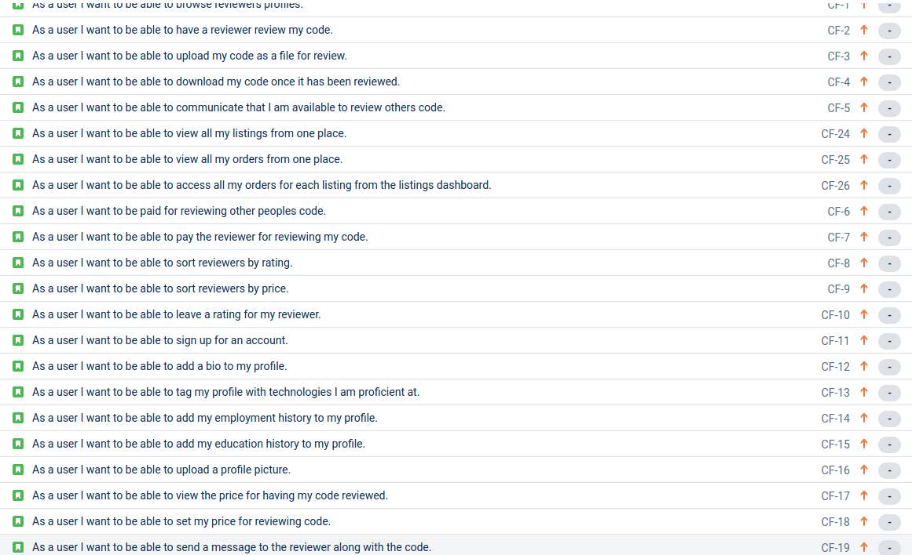


